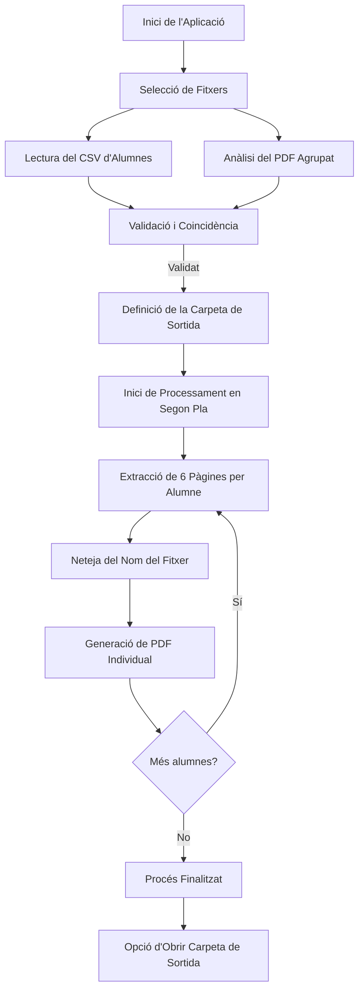

# 📄 Separador d'Informes d'Alumnes

Aquesta utilitat d'escriptori permet separar un fitxer PDF d'informes agrupats (on cada informe d'alumne ocupa exactament **6 pàgines**) en fitxers PDF individuals, anomenant automàticament cada arxiu de sortida segons les dades del corresponent alumne extretes d'un llistat CSV.

El programa compta amb una interfície gràfica d'usuari (GUI) moderna, intuïtiva i neta, a més d'executar els processos pesants en segon pla per evitar que l'aplicació es bloquegi durant el processament.

---

## 🛠️ Requisits de Funcionament (Necessitats)

Per tal que el programa funcioni correctament, és necessari disposar dels següents elements:

### 1. Entorn d'execució

* **Python 3.x** instal·lat al sistema.

### 2. Llibreries de Python

* **Interfície Gràfica (`tkinter`)**: Sol venir instal·lada per defecte amb Python. En sistemes Linux basats en Debian/Ubuntu, si no la teniu, es pot instal·lar amb:
  
  ```bash
  sudo apt install python3-tk
  ```
* **Processament de PDF (`PyPDF2` o `pypdf`)**: El programa és compatible amb totes dues. Si no en teniu cap instal·lada, podeu instal·lar `PyPDF2` executant la següent comanda al terminal:
  
  ```bash
  pip install PyPDF2
  ```
  
  *(També és totalment compatible amb la llibreria més moderna `pypdf`: `pip install pypdf`)*

### 3. Format dels fitxers d'entrada

#### A. Fitxer CSV d'Alumnes

El fitxer CSV que conté el llistat d'alumnes ha de complir el següent:

* Estar separat per comes (`,`) o punt i comes (`;`).
* El programa és flexible amb l'encodificació i provarà automàticament diverses codificacions comunes per evitar errors amb caràcters especials i accents (`utf-8-sig`, `utf-8`, `latin-1`, `cp1252`).
* Ha de contenir, com a mínim, tres columnes amb les capçaleres següents (no importa l'ordre):
  * **`NOM`**: El nom de l'alumne/a.
  * **`COGNOM1`**: El primer cognom de l'alumne/a.
  * **`RALC`**: El codi d'identificació de l'alumne/a al registre d'alumnes de Catalunya.

#### B. Fitxer PDF Agrupat

* Ha de ser un document PDF on es concatenen els informes de tot el grup d'alumnes.
* Cada informe individual ha d'ocupar exactament **6 pàgines** consecutives.

---

## ⚙️ Com Funciona el Programa

La lògica interna de l'aplicació `separador_informes.py` està dividida en diverses parts de forma eficient:



### 1. Interfície Gràfica (GUI)

L'aplicació es divideix en 3 seccions de configuració clares més una barra d'execució:

* **Secció 1: Fitxers de configuració**: Permet triar interactivament el fitxer CSV d'alumnes i el fitxer PDF d'informes mitjançant un diàleg de selecció de fitxers.
* **Secció 2: Resum de les dades detectades**: Mostra a l'instant la quantitat d'alumnes del CSV i el nombre de pàgines / informes (divisions de 6 pàgines) detectats al PDF. 
  * Si la xifra d'alumnes i informes coincideix, mostra un missatge d'**encaix perfecte**.
  * Si no coincideix, s'informa mitjançant un avís de quants informes es generaran (el valor mínim entre el nombre d'alumnes i el d'informes disponibles al PDF), processant-los en el que apareixen al CSV.
* **Secció 3: Carpeta de sortida**: Suggereix de forma automàtica una subcarpeta anomenada `informes_separats_[NomFitxerPDF]` en el mateix directori on està situat el PDF original, tot i que es pot modificar si es desitja.

### 2. Generació i Neteja de Fitxers

* **Fórmula de divisió**: Per a cada alumne `i` en el llistat, s'extrauran les pàgines compreses entre `i * 6` (inici) i `i * 6 + 6` (final).
* **Neteja de caràcters**: Els noms dels fitxers es purguen de caràcters no permesos per als sistemes operatius (`\ / : * ? " < > |`) mitjançant expressions regulars.
* **Nomenclatura**: Els fitxers resultants segueixen l'estructura:
  
  ```
  AD_[Nom]_[Cognom1]_[RALC].pdf
  ```
  
  *Exemple:* `AD_Julia_Diaz_1234567890.pdf`

### 3. Processament en Fil de Fons (Threading)

Per evitar que la interfície es mostri com a "No respon" durant la divisió dels PDF, el procés s'executa en un fil (`Thread`) independent. Durant el processament, una barra de progrés animada s'actualitza en temps real mostrant l'estat i el nom de l'alumne que s'està processant.

### 4. Accions posteriors

Un cop finalitzada la feina, es mostra un quadre de diàleg de confirmació i apareix un botó dinàmic que permet **obrir directament la carpeta de sortida** a l'explorador de fitxers del sistema operatiu (compatible amb Windows, macOS i Linux).

---

## 🚀 Instruccions d'Ús

1. **Instal·lació de dependències** (si no les teniu):
   
   ```bash
   pip install PyPDF2
   ```
2. **Execució de l'aplicació**:
   Obre un terminal al directori del projecte i executa:
   
   ```bash
   python separador_informes.py
   ```
3. **Flux de treball a la pantalla**:
   1. Fes clic a **"Selecciona CSV..."** i tria el fitxer amb les dades dels alumnes.
   2. Fes clic a **"Selecciona PDF..."** i tria el fitxer amb els informes agrupats de 6 pàgines.
   3. *(Opcional)* Revisa que la carpeta de sortida suggerida a la Secció 3 sigui del teu gust. Si no, fes clic a **"Canvia carpeta..."**.
   4. Fes clic al botó verd **"Comença la Divisió dels Informes"**.
   5. Espera que la barra de progrés arribi al 100%. Quan acabi, prem **"Obrir carpeta de sortida"** per veure els arxius generats.

---

## 📄 Autoria i Llicència

* **Autor**: Josep M.
* **Versió**: 1.0 (Juny de 2026)
* **Llicència**: Aquest projecte està subjecte a la llicència internacional **Creative Commons Reconeixement-NoComercial-CompartirIgual 4.0** ([CC BY-NC-SA 4.0](https://creativecommons.org/licenses/by-nc-sa/4.0/deed.ca)). 
  Això us permet compartir i adaptar el codi sempre que es reconegui l'autoria original, no se'n faci un ús comercial i es distribueixi sota la mateixa llicència.
